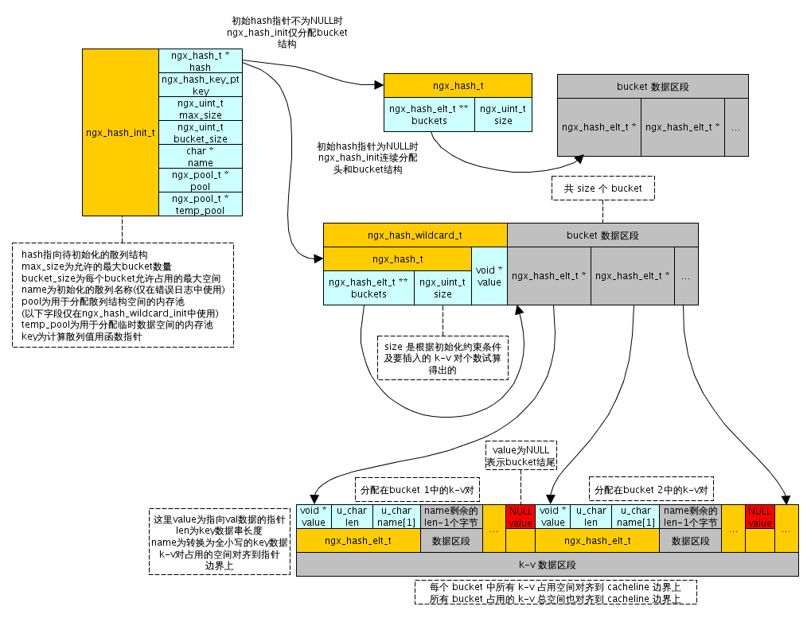

## ngx的hash表以及正则hash表的实现


### ngx_hash_init函数详解
ngx_hash_init是nginx构造基本hash表的函数。当http模块的解析完全完成后，对于所有的server_name，nginx为了优化检索效率，会对server_name建立若干的hash表，ngx_hash_init是其中的一种。nginx的hash表应用场景比较有意思:
>nginx中的hash表只有检索操作而没有插入rehash的操作

因此nginx在选择hash表的size的时候比较慎重，nginx利用自己的算法选择一个碰撞最少并且长度最小的优化hash表size。在详细了解这个函数之前，需要记住
>nginx有自己的内存分布处理，nginx完全接手系统内存，自己做数据与内存的映射，看代码的时候一定要联想数据在内存中的分布

代码如下：
```
ngx_int_t
ngx_hash_init(ngx_hash_init_t *hinit, ngx_hash_key_t *names, ngx_uint_t nelts)
{
    u_char          *elts;
    size_t           len;
    u_short         *test;
    ngx_uint_t       i, n, key, size, start, bucket_size;
    ngx_hash_elt_t  *elt, **buckets;

    for (n = 0; n < nelts; n++) {
		// 宏NGX_HASH_ELT_SIZE就是一个hash表中元素ngx_hash_elt_t的实际内存大小，最后加一个sizeof(void*)的原因是
		// 一个hash bucket是以一个null结束的，nginx采用开放寻址方式进行碰撞处理
		// NGX_HASH_ELT_SIZE的值与实际的server_name值的长度相关，如果设置的太长需要修改bucket_size的值
		// 即配置server_names_hash_bucket_size选项
        if (hinit->bucket_size < NGX_HASH_ELT_SIZE(&names[n]) + sizeof(void *))
        {
            ngx_log_error(NGX_LOG_EMERG, hinit->pool->log, 0,
                          "could not build the %s, you should "
                          "increase %s_bucket_size: %i",
                          hinit->name, hinit->name, hinit->bucket_size);
            return NGX_ERROR;
        }
    }
	// test是一个精髓的设计，用来检测最短的碰撞最少的hash size
	// test中的第i个元素，表示key的hash值为i的键当前的内存偏移
    test = ngx_alloc(hinit->max_size * sizeof(u_short), hinit->pool->log);
    if (test == NULL) {
        return NGX_ERROR;
    }

    bucket_size = hinit->bucket_size - sizeof(void *);

    start = nelts / (bucket_size / (2 * sizeof(void *)));
    start = start ? start : 1;

    if (hinit->max_size > 10000 && nelts && hinit->max_size / nelts < 100) {
        start = hinit->max_size - 1000;
    }

    for (size = start; size < hinit->max_size; size++) {

        ngx_memzero(test, size * sizeof(u_short));

        for (n = 0; n < nelts; n++) {
            if (names[n].key.data == NULL) {
                continue;
            }

            key = names[n].key_hash % size;
			// 如果发生碰撞,test[key]的值会越来越大 知道超过bucket_size。
			// 超过了就会增加hash size的值，直到找到一个合适的
            test[key] = (u_short) (test[key] + NGX_HASH_ELT_SIZE(&names[n]));

            if (test[key] > (u_short) bucket_size) {
                goto next;
            }
        }

        goto found;

    next:

        continue;
    }

    ngx_log_error(NGX_LOG_EMERG, hinit->pool->log, 0,
                  "could not build the %s, you should increase "
                  "either %s_max_size: %i or %s_bucket_size: %i",
                  hinit->name, hinit->name, hinit->max_size,
                  hinit->name, hinit->bucket_size);

    ngx_free(test);

    return NGX_ERROR;

found:
	// 每一个test元素的初始化便宜为sizeof(void*)
	// 原因跟上面的注释一致，每一个bucket以一个null结束
    for (i = 0; i < size; i++) {
        test[i] = sizeof(void *);
    }

    for (n = 0; n < nelts; n++) {
        if (names[n].key.data == NULL) {
            continue;
        }
		// 求出每一个bucket需要的内存
        key = names[n].key_hash % size;
        test[key] = (u_short) (test[key] + NGX_HASH_ELT_SIZE(&names[n]));
    }

    len = 0;

    for (i = 0; i < size; i++) {
        if (test[i] == sizeof(void *)) {
            continue;
        }

        test[i] = (u_short) (ngx_align(test[i], ngx_cacheline_size));
		// len是对ngx_cacheline_size对齐后需要的总的hash表的数据内存大小
		// 这块内存用来存放hash表中的所有ngx_hash_elt_t结构
        len += test[i];
    }

    if (hinit->hash == NULL) {
        hinit->hash = ngx_pcalloc(hinit->pool, sizeof(ngx_hash_wildcard_t)
                                             + size * sizeof(ngx_hash_elt_t *));
        if (hinit->hash == NULL) {
            ngx_free(test);
            return NGX_ERROR;
        }

        buckets = (ngx_hash_elt_t **)
                      ((u_char *) hinit->hash + sizeof(ngx_hash_wildcard_t));

    } else {
        buckets = ngx_pcalloc(hinit->pool, size * sizeof(ngx_hash_elt_t *));
        if (buckets == NULL) {
            ngx_free(test);
            return NGX_ERROR;
        }
    }

    elts = ngx_palloc(hinit->pool, len + ngx_cacheline_size);
    if (elts == NULL) {
        ngx_free(test);
        return NGX_ERROR;
    }

    elts = ngx_align_ptr(elts, ngx_cacheline_size);

    for (i = 0; i < size; i++) {
        if (test[i] == sizeof(void *)) {
            continue;
        }

        buckets[i] = (ngx_hash_elt_t *) elts;
        elts += test[i];

    }

    for (i = 0; i < size; i++) {
        test[i] = 0;
    }

    for (n = 0; n < nelts; n++) {
        if (names[n].key.data == NULL) {
            continue;
        }

        key = names[n].key_hash % size;
        elt = (ngx_hash_elt_t *) ((u_char *) buckets[key] + test[key]);

        elt->value = names[n].value;
        elt->len = (u_short) names[n].key.len;

        ngx_strlow(elt->name, names[n].key.data, names[n].key.len);

        test[key] = (u_short) (test[key] + NGX_HASH_ELT_SIZE(&names[n]));
    }

    for (i = 0; i < size; i++) {
        if (buckets[i] == NULL) {
            continue;
        }

        elt = (ngx_hash_elt_t *) ((u_char *) buckets[i] + test[i]);
		// 每一个bucket以一个NULL结尾，这里给每一个bucket的结尾赋值一个null
        elt->value = NULL;
    }

    ngx_free(test);

    hinit->hash->buckets = buckets;
    hinit->hash->size = size;

    return NGX_OK;
}

```

ngx_hash的内存结构图如下：


### ngx_hash_find详解
如果明白了ngx_hash_init函数，ngx_hash_find就非常简单了,比较有意思的就是,ngx_hash如何需要碰撞中的next元素，代码如下
```
elt = (ngx_hash_elt_t *) ngx_align_ptr(&elt->name[0] + elt->len,sizeof(void *));
```
为什么上一个elt->name[0]便宜elt->len就可以找到下一个ngx_hahs_elt_t呢。可以仔细看一下ngx_hash的结构图。因为ngx_hash在发生碰撞的时候，会将元素直接放到上一个元素后面。所以偏移len后再内存中刚好走到下一个元素。如果下一个元素的value是NULL则说明是bucket中的最后一个元素。

### ngx通配hash表
nginx支持两种通配符，一种是前缀一种是后缀,即www.test.\*或者\*.www.test。
这两种的处理方法几乎一样，\*.www.test可以假设是test.www.\*,在匹配的时候我们从后往前进行点分单词匹配就可以。
ngx对于统配的支持在于对哈希表元素ngx_hahs_elt_t中value值的各种变化来实现,在一个统配的哈希表中ngx_hahs_elt_t中的valu可能是
1. 指向一个真正的value内容
2. 指向一个下层的ngx_hash_wildcard_t哈希表
所以在创建以及查询的过程中都涉及到递归的使用
